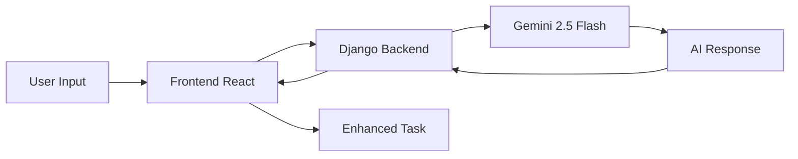

# Smart Todo AI
## Context-Driven Tasks with AI Smart Suggestions

An AI-powered task manager built with **React + TypeScript (frontend)** and **Django (backend)**.  
Features **Gemini 2.5 Flash** AI suggestions for **task priority**, **deadlines**, **enhanced descriptions**, and **automatic categorization**.

---

## Screenshots

**Dashboard View**  


---

## Quick Start Commands

```bash
# Clone and setup
git clone https://github.com/Abdulla-1234/Smart-Todo-AI.git
cd Smart-Todo-AI

# Backend setup
cd backend
python -m venv venv
source venv/bin/activate  # Windows: venv\Scripts\activate
pip install -r requirements.txt
python manage.py makemigrations
python manage.py migrate
python manage.py createsuperuser
python manage.py runserver

# Frontend setup (in new terminal)
cd frontend
npm install
npm i
npm run dev
```

**Access URLs:**
- **Frontend:** http://localhost:5173
- **Backend API:** http://localhost:8000
- **Django Admin:** http://localhost:8000/admin

---

## Environment Variables

Create a `.env` file inside `backend/` (same level as `manage.py`):

```ini
GOOGLE_API_KEY=your_google_gemini_api_key_here
DJANGO_SECRET_KEY=dev-secret-key
DJANGO_DEBUG=1
DJANGO_ALLOWED_HOST=*
POSTGRES_DB=smarttodo
POSTGRES_USER=postgres
POSTGRES_PASSWORD=postgres
POSTGRES_HOST=127.0.0.1
POSTGRES_PORT=5432
```

---

## Project Structure

```
Smart-Todo-AI/
│
├── backend/                # Django backend
│   ├── smarttodo/          # Project settings
│   ├── tasks_app/          # Task, context, and AI API endpoints
│   ├── manage.py
│   └── requirements.txt
│
└── frontend/               # React + Vite frontend
    ├── components/
    ├── pages/
    ├── lib/api.ts          # API service layer
    ├── types.ts
    └── package.json
```

---

## Tech Stack

### Frontend
- **Vite + React + TypeScript**
- **TailwindCSS**
- **shadcn/ui**
- **Fetch API** for backend calls

### Backend
- **Django + Django REST Framework**
- **PostgreSQL** (recommended) / **SQLite** (quick start)
- **Google Gemini 2.5 Flash API** for AI suggestions
- **dotenv** for environment variables

---

## Detailed Setup Guide

### 1️⃣ Backend Setup (Django)

#### Create and activate virtual environment
```bash
cd backend
python -m venv venv
# Windows
venv\Scripts\activate
# macOS/Linux
source venv/bin/activate
```

#### Install dependencies
```bash
pip install -r requirements.txt
```

#### Configure Database

**Option A — PostgreSQL (Recommended)**

```sql
CREATE DATABASE smarttodo;
CREATE USER smartuser WITH PASSWORD 'smartpass';
ALTER ROLE smartuser SET client_encoding TO 'utf8';
ALTER ROLE smartuser SET default_transaction_isolation TO 'read committed';
ALTER ROLE smartuser SET timezone TO 'UTC';
GRANT ALL PRIVILEGES ON DATABASE smarttodo TO smartuser;
```

Update `backend/smarttodo/settings.py`:
```python
DATABASES = {
    "default": {
        "ENGINE": "django.db.backends.postgresql",
        "NAME": "smarttodo",
        "USER": "smartuser",
        "PASSWORD": "smartpass",
        "HOST": "127.0.0.1",
        "PORT": "5432",
    }
}
```

**Option B — SQLite (Quick Start)**

```python
DATABASES = {
    "default": {
        "ENGINE": "django.db.backends.sqlite3",
        "NAME": BASE_DIR / "db.sqlite3",
    }
}
```

#### Apply migrations & create superuser
```bash
python manage.py makemigrations
python manage.py migrate
python manage.py createsuperuser
```

#### Start backend server
```bash
python manage.py runserver
```

### 2️⃣ Frontend Setup (React + Vite)

#### Install dependencies
```bash
cd frontend
npm install
```

#### Configure API URL
Edit `src/lib/api.ts`:
```typescript
const BASE_URL = "http://localhost:8000";
```

#### Start frontend
```bash
npm run dev
```

---

## AI Suggestions Flow

1. User enters task title (and optionally a description).
2. Frontend calls `/ai/suggestions/` in Django.
3. Backend sends prompt to **Gemini 2.5 Flash** with:
   - Task title & description
   - Context from previous tasks
4. AI returns:
   - `priority_score` (0–100 scale internally, mapped to 1–5)
   - `deadline`
   - `enhanced_description`
   - `category`
5. User reviews → Saves task → Task stored in `/tasks/`.

---

## API Documentation

### Get AI Suggestions
**POST** `/ai/suggestions/`

**Request:**
```json
{
  "title": "Buy groceries",
  "description": "Milk, eggs, bread"
}
```

**Response:**
```json
{
  "priority_score": 3,
  "deadline": "2025-08-15",
  "enhanced_description": "Buy essential groceries including milk, eggs, and bread.",
  "category": "Personal"
}
```

### Create Task
**POST** `/tasks/`

**Request:**
```json
{
  "title": "Prepare project report",
  "description": "For Q3 meeting",
  "priority": 4,
  "category": 2,
  "deadline": "2025-08-20"
}
```

---

## Known Issues & Roadmap

### Current Issues
- [ ] AI suggestions may take 2–3 seconds to load
- [ ] Mobile responsiveness could be improved

### Future Features
- [ ] Task collaboration & sharing
- [ ] AI learning from user patterns
- [ ] Calendar integration
- [ ] Mobile app (React Native)
- [ ] Task analytics and reporting

---


## Troubleshooting

### Common Issues

**"Missing GOOGLE_API_KEY"**
- Check `.env` file in `backend/` and restart Django.

**No AI response**
- Ensure internet access and that your Gemini API key is active.

**CORS errors**
- Verify `CORS_ALLOW_ALL_ORIGINS = True` in `settings.py`.

**Frontend not connecting**
- Confirm `BASE_URL` in `frontend/src/lib/api.ts`.

---

## 🚀 Features

- ✅ **Smart AI Suggestions** powered by Google Gemini 2.5 Flash
- ✅ **Context-aware** task management
- ✅ **Enhanced descriptions** generated by AI
- ✅ **Category auto-classification**
- ✅ **Priority scoring** (1-5 scale)
- ✅ **Deadline prediction** based on task urgency
- ✅ **Modern UI** with TailwindCSS and shadcn/ui
- ✅ **REST API** with Django REST Framework
- ✅ **Real-time updates** and responsive design

---

## Development

### Prerequisites
- Python 3.8+
- Node.js 16+
- PostgreSQL (optional, SQLite works for development)
- Google Gemini API Key

### Getting Google Gemini API Key
1. Visit [Google AI Studio](https://makersuite.google.com/app/apikey)
2. Create a new API key
3. Add it to your `.env` file as `GOOGLE_API_KEY`

### Contributing
1. Fork the repository
2. Create a feature branch (`git checkout -b feature/amazing-feature`)
3. Make your changes
4. Commit your changes (`git commit -m 'Add some amazing feature'`)
5. Push to the branch (`git push origin feature/amazing-feature`)
6. Open a Pull Request

---

## Acknowledgments

- **Django & React** communities
- **Google Generative AI** (Gemini)
- **Contributors & testers**
- Open source libraries and frameworks used

---

## How AI Works in This App



1. **User Input** → User types task title/description
2. **Frontend** → Sends request to Django API
3. **Backend** → Processes and sends to Gemini
4. **Gemini AI** → Analyzes and generates suggestions
5. **Response** → AI returns priority, deadline, category
6. **Display** → User sees enhanced task suggestions

---

## Sample AI Suggestions

| Input Task | AI Priority | AI Deadline | AI Category | AI Enhanced Description |
|------------|-------------|-------------|-------------|------------------------|
| "Buy milk" | 2 | Tomorrow | Personal | Purchase fresh milk for daily consumption |
| "Finish report" | 5 | 2 days | Work | Complete quarterly performance report for management review |
| "Call doctor" | 4 | This week | Health | Schedule medical appointment for routine check-up |
| "Learn React" | 3 | 1 month | Learning | Begin React.js tutorial series for frontend development |

---

## Running in Production

### Environment Setup
```bash
# Production environment variables
DJANGO_DEBUG=0
DJANGO_ALLOWED_HOST=yourdomain.com
GOOGLE_API_KEY=your_production_api_key
```

### Docker Support (Coming Soon)
- Docker containerization
- Docker Compose for easy deployment
- Production-ready configurations

---

## Security Notes

- Keep your `GOOGLE_API_KEY` secure and never commit it to version control
- Use environment variables for all sensitive data
- In production, set `DEBUG=False` and configure `ALLOWED_HOSTS`
- Implement proper authentication and authorization
- Use HTTPS in production environments

---

## Performance Tips

- AI suggestions are cached for 5 minutes to reduce API calls
- Database queries are optimized with proper indexing
- Frontend uses React's built-in optimization features
- Consider implementing pagination for large task lists

---

## Testing

```bash
# Backend tests
cd backend
python manage.py test

# Frontend tests
cd frontend
npm test
```

---

## Analytics & Monitoring

Future versions will include:
- Task completion analytics
- AI suggestion accuracy tracking
- User productivity metrics
- Performance monitoring dashboard

---
## Contact

**Developer:** D Mohammad Abdulla

- 📧 **Email:** mohammadabdulla20march@gmail.com
- 💼 **LinkedIn:** [Profile](https://linkedin.com/in/mohammad-abdulla)
- 🐙 **GitHub:** [Profile](https://github.com/Abdulla-1234)

---
